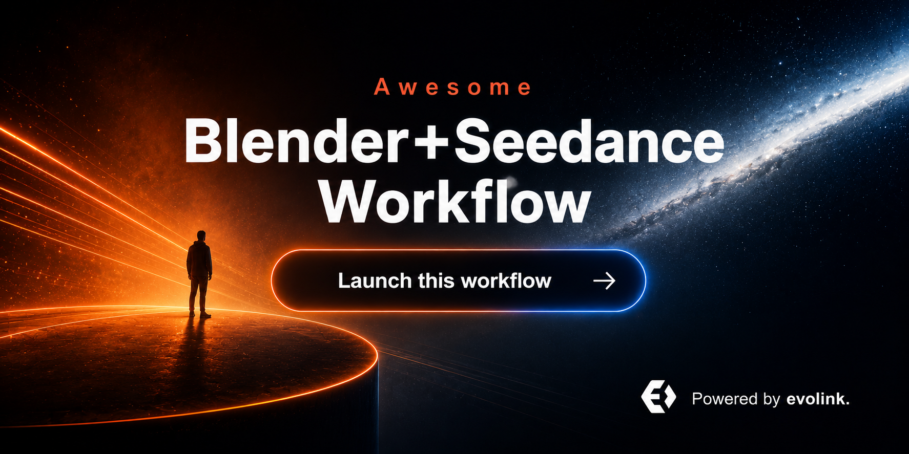

<div align="center">

<a href="#quick-start"></a>

[](LICENSE)
[](#quick-start)
[](#quick-start)
[](#quick-start)

[](README.md)
[](README_es.md)
[](README_pt.md)
[](README_ja.md)
[](README_ko.md)
[](README_de.md)
[](README_fr.md)
[](README_tr.md)
[](README_zh-TW.md)
[](README_zh-CN.md)
[](README_ru.md)

</div>

## 🍌 Introduction

Репозиторий use cases Blender + Seedance.

**Мы собираем реальные workflow с Blender, Blender MCP, viewport, previs, FBX, Mixamo, ComfyUI и агентами для управления генерацией видео Seedance.**

Текущая коллекция основана на X/Twitter данных, предоставленных владельцем. Каждый кейс ведет к исходному посту и профилю автора.

Quick Start ниже показывает setup Blender MCP, установку EvoLink skills, настройку API key и запуск внутри агента.

## 📊 Overview

- **25 отобранных кейсов Blender + Seedance** из публичных постов авторов в датасете владельца.
- Охватывает управление камерой, Blender previs, блокинг нескольких персонажей, постановку экшена, Blender MCP, blockout с Codex/Claude, FBX/Mixamo references, ComfyUI/style transfer и известные ограничения.
- Каждый кейс содержит исходный пост, автора, краткий вывод, тип доказательства и дату публикации.
- Публичный список пересобран из аудита 35 кандидатов и новых ссылок в 25 основных кейсов.
- Этот repo помогает изучить реальные workflows перед переходом к финальной landing page EvoLink MCP + skill.

> [!NOTE]
> Коллекция ставит конкретные доказательства выше хайпа: шаги, reference video, agent/MCP, воспроизводимые условия и явные ограничения.

<a id="quick-start"></a>
## ⚡ Quick Start Workflow

Сначала настройте локальное управление Blender, затем установите EvoLink skills, которые будет вызывать агент.

### 1. Установить Blender MCP

Следуйте официальному setup Blender MCP, откройте Blender и проверьте, что агент подключается к Blender MCP server до генерации references.

- Официальный setup: [Blender MCP setup](https://projects.blender.org/lab/blender_mcp/wiki/Setup)

### 2. Установить EvoLink skills

Установите skill для генерации Seedance и skill для Topaz upscale в workspace агента.

```bash
npm i evolink-seedance
npm i evolink-topaz-video-upscale
```

### 3. Получить API key

Создайте API key в аккаунте EvoLink и передайте его в runtime агента.

```bash
export EVOLINK_API_KEY="<your-evolink-api-key>"
```

### 4. Запустить внутри агента

Когда MCP, skills и API key готовы, попросите агента создать Blender blockout, экспортировать reference video, сгенерировать результат через Seedance и при необходимости улучшить финальный клип через Topaz.

```text
Use Blender MCP to create a rough 5-second camera blockout for this shot, export it as a reference video, generate the final video with Seedance, then upscale the output with Topaz if the result is approved.
```

> [!NOTE]
> Страница Blender MCP setup остается главным источником деталей установки со стороны Blender.

## 📑 Меню

| Раздел | Кейсы |
|---|---|
| [🎥 Camera Control & Previs / Управление камерой и превиз](#camera-control-previs) | Case 1, 2, 3, 4, 5 |
| [🎬 Character & Action Blocking / Блокинг персонажей и экшена](#character-action-blocking) | Case 6, 8, 9, 21 |
| [🤖 Agentic Blender MCP / Агентный Blender MCP](#agentic-blender-mcp) | Case 10, 11, 22 |
| [🧩 Reference, Prompt & Multi-Input Mapping / Референсы, промпты и multi-input mapping](#reference-prompt-multi-input-mapping) | Case 13, 14, 23, 24, 26, 27 |
| [🛠️ Production Pipelines & Toolchains / Производственные пайплайны и инструменты](#production-pipelines-toolchains) | Case 15, 16, 17, 18 |
| [🧪 Limits, Tests & Troubleshooting / Ограничения, тесты и разбор ошибок](#limits-tests-troubleshooting) | Case 20, 25, 28 |
| [🙏 Благодарности](#acknowledge) | Credits and correction policy |

<a id="camera-control-previs"></a>
### 🎥 Camera Control & Previs / Управление камерой и превиз

| Кейс | Что показывает | Тип |
|---|---|---|
| [Blender Blockout as Seedance Motion Reference](#case-1) | A merged direction workflow: use the full gray-box method from the original case, then push it into action-previs timing, speed, shake, and spatial choreography before Seedance generation. | Demo |
| [Camera Blocking with Midjourney Start Frame](#case-2) | A compact precision-camera recipe: Blender supplies the camera move, Midjourney supplies the start frame, and Seedance follows the motion reference. | Demo |
| [ComfyUI Camera Control with Blender Previs](#case-3) | A ComfyUI control case where Blender previz is combined with separate upright and upside-down reference frames to test motion adherence. | Demo |
| [Viewport Preview to Realistic Start Frame](#case-4) | A short viewport-preview tutorial: block out the scene, export the preview, turn the first frame realistic, then provide both references to Seedance. | Demo |
| [One Reference Video, Multiple Worlds](#case-5) | A style/world-variation case where the same Blender reference video drives different generated worlds in Seedance. | Demo |

<a id="character-action-blocking"></a>
### 🎬 Character & Action Blocking / Блокинг персонажей и экшена

| Кейс | Что показывает | Тип |
|---|---|---|
| [Multi-Character Dialogue with Matched Poses](#case-6) | A dialogue-shot workflow where Blender is used to match character poses and camera motion before Seedance generates the performed scene. | Demo |
| [Handheld Follow Camera through Space](#case-8) | A handheld-follow case where Blender controls how a character travels through space and Seedance carries the gritty camera move into the final video. | Demo |
| [Camera and Character Blocking for Tactical Action](#case-9) | A tactical blocking case where Blender directs camera orbit, lens choice, cover positions, gunfire beats, and character movement before generation. | Demo |
| [Ambush Scene Previs Beyond a Simple Camera Move](#case-21) | An ambush-scene case showing how Blender previs can solve staging, timing, and camera movement before Seedance generates the shot. | Demo |

<a id="agentic-blender-mcp"></a>
### 🤖 Agentic Blender MCP / Агентный Blender MCP

| Кейс | Что показывает | Тип |
|---|---|---|
| [Codex + Blender MCP Reference Video Workflow](#case-10) | An agentic Blender MCP case where Codex builds a simple 3D market, cat motion, camera framing, and an MP4 reference for Seedance. | Integration |
| [Codex-Built Architecture and Camera Work](#case-11) | A Codex-assisted beginner case where architecture and camera work are generated in Blender and then tested as Seedance reference motion. | Integration |
| [Claude-Built Blender MCP Previs in Minutes](#case-22) | A fast agentic-previs case where Claude uses Blender MCP to build a shot reference in two to three minutes. | Integration |

<a id="reference-prompt-multi-input-mapping"></a>
### 🧩 Reference, Prompt & Multi-Input Mapping / Референсы, промпты и multi-input mapping

| Кейс | Что показывает | Тип |
|---|---|---|
| [Reproducible Seedance Prompt with Blender Reference](#case-13) | A merged reproducibility and troubleshooting case: the setup spells out the reference-video conditions, while the paired test records where camera/rhythm control worked and foot motion failed. | Tutorial |
| [Mixamo Motion as Beginner Blender Reference](#case-14) | A beginner-friendly motion-source case: use Mixamo motion in Blender as the controllable movement base before sending the reference to Seedance. | Tutorial |
| [Position-Only Reference Control for a Faster Scene](#case-23) | A reference-weighting case: keep the reference useful for positions while letting the prompt recover speed and dynamism. | Tutorial |
| [Physical Toy Reference Instead of 3D Software](#case-24) | A physical-reference case: use toys as quick motion and staging references when opening Blender is too much overhead. | Demo |
| [Reference Control for a Specific Failed Prompt Scene](#case-26) | A control fallback case: when prompt-only generation fails, use a reference to force the scene even if some dynamism is reduced. | Demo |
| [Character Proportion and Simple Background Tips](#case-27) | A stability checklist case: match character proportions beyond height and simplify any background that does not need precise alignment. | Tutorial |

<a id="production-pipelines-toolchains"></a>
### 🛠️ Production Pipelines & Toolchains / Производственные пайплайны и инструменты

| Кейс | Что показывает | Тип |
|---|---|---|
| [Hermes, Krea, ComfyUI and Blender MCP Stack](#case-15) | A multi-tool agent pipeline where Hermes installs and connects Krea, ComfyUI, Blender MCP, and Seedance to produce both image and physical references. | Integration |
| [Blender MCP Viewport to Seedance Style Transfer](#case-16) | A viewport-to-style-transfer case: Blender MCP provides camera and element control, then Seedance/Magnific add texture and lighting. | Integration |
| [Blender Previz to Anime Seedance Render](#case-17) | A 3D-previs-to-anime case showing how camera moves and motion can be preserved while Seedance changes the render style. | Integration |
| [FBX Clay Pass with Claude-Keyframed Camera](#case-18) | An FBX clay-pass workflow where Blender imports the motion, Claude helps keyframe camera moves, and the rendered pass becomes Seedance reference video. | Integration |

<a id="limits-tests-troubleshooting"></a>
### 🧪 Limits, Tests & Troubleshooting / Ограничения, тесты и разбор ошибок

| Кейс | Что показывает | Тип |
|---|---|---|
| [Reference-Only Blender Blockout without Start Frame](#case-20) | A no-start-frame variant showing that Blender blockout plus detailed environment references can work when the workflow cannot rely on a starter frame. | Limit |
| [Toy Reference Prompt Reinforcement and NG Example](#case-25) | A troubleshooting case showing why reference videos often need prompt reinforcement instead of raw imitation. | Limit |
| [Cloth Physics Stress Test with Blender and Seedance](#case-28) | A cloth-physics stress test showing where Blender-guided Seedance can work but still needs iteration for difficult motion. | Limit |

<a id="camera-control-previs-cases"></a>
## 🎥 Camera Control & Previs / Управление камерой и превиз

<a id="case-1"></a>
### Case 1: [Blender Blockout as Seedance Motion Reference](https://x.com/noman23761/status/2071534020014563328) (by [@noman23761](https://x.com/noman23761))

**A merged direction workflow: use the full gray-box method from the original case, then push it into action-previs timing, speed, shake, and spatial choreography before Seedance generation.**

- Заметки источника: Merged with former case 7: together these sources show the full gray-box workflow and the action-previs variant with rough timing, speed, shake, and spatial choreography.
- Audit status: kept after manual duplicate and originality review.
- Предпросмотр видео:

https://github.com/user-attachments/assets/c56d8da8-6ebf-430b-b012-0a85e28c092b

Тип: Demo | Дата: 2026-06-29

---

<a id="case-2"></a>
### Case 2: [Camera Blocking with Midjourney Start Frame](https://x.com/reidhannaford/status/2069074506849685773) (by [@reidhannaford](https://x.com/reidhannaford))

**A compact precision-camera recipe: Blender supplies the camera move, Midjourney supplies the start frame, and Seedance follows the motion reference.**

- Заметки источника: The source gives a clear three-step workflow and reports that the generated video tracks the Blender camera move closely.
- Audit status: kept after manual duplicate and originality review.
- Предпросмотр видео:

https://github.com/user-attachments/assets/4bbd421d-dc83-4cae-927d-caa0f7aa143a

Тип: Demo | Дата: 2026-06-22

---

<a id="case-3"></a>
### Case 3: [ComfyUI Camera Control with Blender Previs](https://x.com/JMSvid/status/2070258132840796579) (by [@JMSvid](https://x.com/JMSvid))

**A ComfyUI control case where Blender previz is combined with separate upright and upside-down reference frames to test motion adherence.**

- Заметки источника: The case is useful because it combines Blender previz with multiple still references inside a ComfyUI-style control setup.
- Audit status: kept after manual duplicate and originality review.
- Предпросмотр видео:

https://github.com/user-attachments/assets/987cf30d-de8b-4cf1-809a-5deaea8ceff0

Тип: Demo | Дата: 2026-06-25

---

<a id="case-4"></a>
### Case 4: [Viewport Preview to Realistic Start Frame](https://x.com/DiabloNemesis/status/2070441923706503380) (by [@DiabloNemesis](https://x.com/DiabloNemesis))

**A short viewport-preview tutorial: block out the scene, export the preview, turn the first frame realistic, then provide both references to Seedance.**

- Заметки источника: The post gives a concise workflow with concrete artifacts: viewport preview, first-frame image, and Seedance reference video. The duplicate case 29 media was removed so the public case shows only one copy of the same video.
- Audit status: kept after manual duplicate and originality review.
- Предпросмотр видео:

https://github.com/user-attachments/assets/5b39d216-e84a-4372-83e6-a636bcf9d2fe

Тип: Demo | Дата: 2026-06-26

---

<a id="case-5"></a>
### Case 5: [One Reference Video, Multiple Worlds](https://x.com/koldo2k/status/2071307945002815967) (by [@koldo2k](https://x.com/koldo2k))

**A style/world-variation case where the same Blender reference video drives different generated worlds in Seedance.**

- Заметки источника: The source is useful because it separates motion control from world/style variation using the same reference video.
- Audit status: kept after manual duplicate and originality review.
- Предпросмотр видео:

https://github.com/user-attachments/assets/a6304e6a-d431-4cf7-9dd2-f664594e34c5

Тип: Demo | Дата: 2026-06-28

---

<a id="character-action-blocking-cases"></a>
## 🎬 Character & Action Blocking / Блокинг персонажей и экшена

<a id="case-6"></a>
### Case 6: [Multi-Character Dialogue with Matched Poses](https://x.com/reidhannaford/status/2069420552394043625) (by [@reidhannaford](https://x.com/reidhannaford))

**A dialogue-shot workflow where Blender is used to match character poses and camera motion before Seedance generates the performed scene.**

- Заметки источника: The source adds multi-character dialogue and pose matching, making it distinct from single-character camera-control demos.
- Audit status: kept after manual duplicate and originality review.
- Предпросмотр видео:

https://github.com/user-attachments/assets/8f92ed66-1c9f-4fc1-885e-71240add8f56

Тип: Demo | Дата: 2026-06-23

---

<a id="case-8"></a>
### Case 8: [Handheld Follow Camera through Space](https://x.com/reidhannaford/status/2070507963429671062) (by [@reidhannaford](https://x.com/reidhannaford))

**A handheld-follow case where Blender controls how a character travels through space and Seedance carries the gritty camera move into the final video.**

- Заметки источника: The source moves the character through the scene while the camera follows, which makes it useful for handheld movement shots.
- Audit status: kept after manual duplicate and originality review.
- Предпросмотр видео:

https://github.com/user-attachments/assets/598b62bd-246c-4699-8a5c-4735b536c380

Тип: Demo | Дата: 2026-06-26

---

<a id="case-9"></a>
### Case 9: [Camera and Character Blocking for Tactical Action](https://x.com/SamJWasserman/status/2070742850095230991) (by [@SamJWasserman](https://x.com/SamJWasserman))

**A tactical blocking case where Blender directs camera orbit, lens choice, cover positions, gunfire beats, and character movement before generation.**

- Заметки источника: The source shows simultaneous camera and character blocking, which is stronger than a simple camera-only reference.
- Audit status: kept after manual duplicate and originality review.
- Предпросмотр видео:

https://github.com/user-attachments/assets/e92e6c44-3fef-4690-bce3-85de50ecf547

Тип: Demo | Дата: 2026-06-27

---

<a id="case-21"></a>
### Case 21: [Ambush Scene Previs Beyond a Simple Camera Move](https://x.com/reidhannaford/status/2071595581508563168) (by [@reidhannaford](https://x.com/reidhannaford))

**An ambush-scene case showing how Blender previs can solve staging, timing, and camera movement before Seedance generates the shot.**

- Заметки источника: Requested as case 21. Kept as a distinct Reid Hannaford example because it pushes the workflow beyond a simple camera move into scene staging.
- Audit status: kept after manual duplicate and originality review.
- Предпросмотр видео:

https://github.com/user-attachments/assets/a254edb3-245d-4bc0-87cc-45bd17e82b99

Тип: Demo | Дата: 2026-06-29

---

<a id="agentic-blender-mcp-cases"></a>
## 🤖 Agentic Blender MCP / Агентный Blender MCP

<a id="case-10"></a>
### Case 10: [Codex + Blender MCP Reference Video Workflow](https://x.com/akiyoshisan/status/2071081230108660199) (by [@akiyoshisan](https://x.com/akiyoshisan))

**An agentic Blender MCP case where Codex builds a simple 3D market, cat motion, camera framing, and an MP4 reference for Seedance.**

- Заметки источника: The author says the test was inspired by another creator, but the described scene, motion, camera, and export process are their own experiment.
- Audit status: kept after manual duplicate and originality review.
- Предпросмотр видео:

https://github.com/user-attachments/assets/cff81cc4-0f72-49d8-881f-aee6ded2d5cf

Тип: Integration | Дата: 2026-06-28

---

<a id="case-11"></a>
### Case 11: [Codex-Built Architecture and Camera Work](https://x.com/6_KAKUU/status/2071051063663452374) (by [@6_KAKUU](https://x.com/6_KAKUU))

**A Codex-assisted beginner case where architecture and camera work are generated in Blender and then tested as Seedance reference motion.**

- Заметки источника: The post is valuable as a beginner Codex workflow: the user delegates architecture and camera work to Codex before Seedance.
- Audit status: kept after manual duplicate and originality review.
- Предпросмотр видео:

https://github.com/user-attachments/assets/247ccf17-4652-4c11-b8dc-efdba1567707

Тип: Integration | Дата: 2026-06-28

---

<a id="case-22"></a>
### Case 22: [Claude-Built Blender MCP Previs in Minutes](https://x.com/JoshDaws/status/2071401550845481090) (by [@JoshDaws](https://x.com/JoshDaws))

**A fast agentic-previs case where Claude uses Blender MCP to build a shot reference in two to three minutes.**

- Заметки источника: Requested as case 22. Kept because it demonstrates speed and agent control rather than manual Blender work.
- Audit status: kept after manual duplicate and originality review.
- Предпросмотр видео:

https://github.com/user-attachments/assets/e9c22c6f-690f-4b3b-984c-a18506580c38

Тип: Integration | Дата: 2026-06-29

---

<a id="reference-prompt-multi-input-mapping-cases"></a>
## 🧩 Reference, Prompt & Multi-Input Mapping / Референсы, промпты и multi-input mapping

<a id="case-13"></a>
### Case 13: [Reproducible Seedance Prompt with Blender Reference](https://x.com/aidoga_lab/status/2070864815275585913) (by [@aidoga_lab](https://x.com/aidoga_lab))

**A merged reproducibility and troubleshooting case: the setup spells out the reference-video conditions, while the paired test records where camera/rhythm control worked and foot motion failed.**

- Заметки источника: Merged with former case 19: the pair keeps both the reproducible setup and the limitation note about foot sliding.
- Audit status: kept after manual duplicate and originality review.
- Предпросмотр видео:

https://github.com/user-attachments/assets/2dabc892-946a-4879-9af0-0e21386b16a5

https://github.com/user-attachments/assets/222be6cc-82c7-4953-9abe-70618f6d499b

Тип: Tutorial | Дата: 2026-06-27

---

<a id="case-14"></a>
### Case 14: [Mixamo Motion as Beginner Blender Reference](https://x.com/tanabe_fragm/status/2070685291183243459) (by [@tanabe_fragm](https://x.com/tanabe_fragm))

**A beginner-friendly motion-source case: use Mixamo motion in Blender as the controllable movement base before sending the reference to Seedance.**

- Заметки источника: The source is useful for beginners because it names Mixamo as a practical motion source for Blender reference videos.
- Audit status: kept after manual duplicate and originality review.
- Предпросмотр видео:

https://github.com/user-attachments/assets/3f04e458-a43f-4860-af2b-88eb6dd397cc

Тип: Tutorial | Дата: 2026-06-27

---

<a id="case-23"></a>
### Case 23: [Position-Only Reference Control for a Faster Scene](https://x.com/kan_mi_no9/status/2071380621214224403) (by [@kan_mi_no9](https://x.com/kan_mi_no9))

**A reference-weighting case: keep the reference useful for positions while letting the prompt recover speed and dynamism.**

- Заметки источника: Requested as case 23. Kept with the paired kan_mi_no9 test as a distinct reference-control variant.
- Audit status: kept after manual duplicate and originality review.
- Предпросмотр видео:

https://github.com/user-attachments/assets/91721f79-eeaf-4309-bc4a-11e8136c6dba

Тип: Tutorial | Дата: 2026-06-28

---

<a id="case-24"></a>
### Case 24: [Physical Toy Reference Instead of 3D Software](https://x.com/gcduncombe/status/2070617538745229546) (by [@gcduncombe](https://x.com/gcduncombe))

**A physical-reference case: use toys as quick motion and staging references when opening Blender is too much overhead.**

- Заметки источника: Requested as case 24. Kept because it expands the reference-video idea beyond software-only previs.
- Audit status: kept after manual duplicate and originality review.
- Предпросмотр видео:

https://github.com/user-attachments/assets/b6a3f37b-ef8c-46c1-ad53-a822797a7c09

Тип: Demo | Дата: 2026-06-26

---

<a id="case-26"></a>
### Case 26: [Reference Control for a Specific Failed Prompt Scene](https://x.com/kan_mi_no9/status/2071168235022827587) (by [@kan_mi_no9](https://x.com/kan_mi_no9))

**A control fallback case: when prompt-only generation fails, use a reference to force the scene even if some dynamism is reduced.**

- Заметки источника: Requested as case 26. Kept as the practical counterpart to the later kan_mi_no9 variation case.
- Audit status: kept after manual duplicate and originality review.
- Предпросмотр видео:

https://github.com/user-attachments/assets/e63c102e-11cf-4381-87fe-8cfe0d96702b

Тип: Demo | Дата: 2026-06-28

---

<a id="case-27"></a>
### Case 27: [Character Proportion and Simple Background Tips](https://x.com/craftcapitallab/status/2070512271391068287) (by [@craftcapitallab](https://x.com/craftcapitallab))

**A stability checklist case: match character proportions beyond height and simplify any background that does not need precise alignment.**

- Заметки источника: Requested as case 27. Kept because it offers specific, reusable setup advice.
- Audit status: kept after manual duplicate and originality review.
- Предпросмотр видео:

https://github.com/user-attachments/assets/71221c71-a7eb-428f-90e5-4a6111aaf890

Тип: Tutorial | Дата: 2026-06-26

---

<a id="production-pipelines-toolchains-cases"></a>
## 🛠️ Production Pipelines & Toolchains / Производственные пайплайны и инструменты

<a id="case-15"></a>
### Case 15: [Hermes, Krea, ComfyUI and Blender MCP Stack](https://x.com/SamJWasserman/status/2069656428437225826) (by [@SamJWasserman](https://x.com/SamJWasserman))

**A multi-tool agent pipeline where Hermes installs and connects Krea, ComfyUI, Blender MCP, and Seedance to produce both image and physical references.**

- Заметки источника: The case demonstrates a broader agent-built creative stack, not just manual Blender previs.
- Audit status: kept after manual duplicate and originality review.
- Предпросмотр видео:

https://github.com/user-attachments/assets/e1df0f87-e93e-4339-b25a-a7ac4c4f8c4e

Тип: Integration | Дата: 2026-06-24

---

<a id="case-16"></a>
### Case 16: [Blender MCP Viewport to Seedance Style Transfer](https://x.com/techhalla/status/2070814203435274715) (by [@techhalla](https://x.com/techhalla))

**A viewport-to-style-transfer case: Blender MCP provides camera and element control, then Seedance/Magnific add texture and lighting.**

- Заметки источника: This is the stronger techhalla source because it explains the viewport animation and downstream style/lighting step.
- Audit status: kept after manual duplicate and originality review.
- Предпросмотр видео:

https://github.com/user-attachments/assets/80143b32-352b-4e86-8c1f-85826d940ba7

Тип: Integration | Дата: 2026-06-27

---

<a id="case-17"></a>
### Case 17: [Blender Previz to Anime Seedance Render](https://x.com/restofart/status/2070086939756159368) (by [@restofart](https://x.com/restofart))

**A 3D-previs-to-anime case showing how camera moves and motion can be preserved while Seedance changes the render style.**

- Заметки источника: The source directly frames the workflow as Blender 3D previz transformed into an anime render while keeping camera motion.
- Audit status: kept after manual duplicate and originality review.
- Предпросмотр видео:

https://github.com/user-attachments/assets/13ba8e79-0b0a-44b9-be29-9c850bdeb95a

Тип: Integration | Дата: 2026-06-25

---

<a id="case-18"></a>
### Case 18: [FBX Clay Pass with Claude-Keyframed Camera](https://x.com/Viggle_PINOC/status/2070183934265012392) (by [@Viggle_PINOC](https://x.com/Viggle_PINOC))

**An FBX clay-pass workflow where Blender imports the motion, Claude helps keyframe camera moves, and the rendered pass becomes Seedance reference video.**

- Заметки источника: The source gives a specific FBX-to-clay-pass process and includes camera keyframing before reference export.
- Audit status: kept after manual duplicate and originality review.
- Предпросмотр видео:

https://github.com/user-attachments/assets/bccdbf9a-b816-403f-ae1f-6e43b1e295a3

Тип: Integration | Дата: 2026-06-25

---

<a id="limits-tests-troubleshooting-cases"></a>
## 🧪 Limits, Tests & Troubleshooting / Ограничения, тесты и разбор ошибок

<a id="case-20"></a>
### Case 20: [Reference-Only Blender Blockout without Start Frame](https://x.com/magneticskiff/status/2070711034793361559) (by [@magneticskiff](https://x.com/magneticskiff))

**A no-start-frame variant showing that Blender blockout plus detailed environment references can work when the workflow cannot rely on a starter frame.**

- Заметки источника: This case covers an important variant where reference images replace the usual start-frame dependency.
- Audit status: kept after manual duplicate and originality review.
- Предпросмотр видео:

https://github.com/user-attachments/assets/dfa129d8-f06b-4018-a5bb-c1ed9e78d0d3

Тип: Limit | Дата: 2026-06-27

---

<a id="case-25"></a>
### Case 25: [Toy Reference Prompt Reinforcement and NG Example](https://x.com/tea_story_hoshi/status/2071002538703479089) (by [@tea_story_hoshi](https://x.com/tea_story_hoshi))

**A troubleshooting case showing why reference videos often need prompt reinforcement instead of raw imitation.**

- Заметки источника: Requested as case 25. Kept because it includes both working examples and a failed comparison.
- Audit status: kept after manual duplicate and originality review.
- Предпросмотр видео:

https://github.com/user-attachments/assets/d333d2d0-8317-49f0-8815-86db783cb578

Тип: Limit | Дата: 2026-06-27

---

<a id="case-28"></a>
### Case 28: [Cloth Physics Stress Test with Blender and Seedance](https://x.com/fatboypink/status/2070577334701473800) (by [@fatboypink](https://x.com/fatboypink))

**A cloth-physics stress test showing where Blender-guided Seedance can work but still needs iteration for difficult motion.**

- Заметки источника: Requested as case 28. Kept as a concrete limitation/stress-test case.
- Audit status: kept after manual duplicate and originality review.
- Предпросмотр видео:

https://github.com/user-attachments/assets/3ab561b2-ef3e-47a5-b2c4-8378a521e491

Тип: Limit | Дата: 2026-06-26

---

<a id="acknowledge"></a>
## 🙏 Благодарности

This repository was inspired by creators who publicly shared Blender + Seedance workflows, tests, prompts, reference videos, and production notes.

- [@noman23761](https://x.com/noman23761)
- [@reidhannaford](https://x.com/reidhannaford)
- [@JMSvid](https://x.com/JMSvid)
- [@DiabloNemesis](https://x.com/DiabloNemesis)
- [@koldo2k](https://x.com/koldo2k)
- [@SamJWasserman](https://x.com/SamJWasserman)
- [@akiyoshisan](https://x.com/akiyoshisan)
- [@6_KAKUU](https://x.com/6_KAKUU)
- [@aidoga_lab](https://x.com/aidoga_lab)
- [@tanabe_fragm](https://x.com/tanabe_fragm)
- [@techhalla](https://x.com/techhalla)
- [@restofart](https://x.com/restofart)
- [@Viggle_PINOC](https://x.com/Viggle_PINOC)
- [@magneticskiff](https://x.com/magneticskiff)
- [@JoshDaws](https://x.com/JoshDaws)
- [@kan_mi_no9](https://x.com/kan_mi_no9)
- [@gcduncombe](https://x.com/gcduncombe)
- [@tea_story_hoshi](https://x.com/tea_story_hoshi)
- [@craftcapitallab](https://x.com/craftcapitallab)
- [@fatboypink](https://x.com/fatboypink)

*We cannot guarantee that every case is attributed to the original creator. If anything needs to be corrected, please contact us and we will update it.*

If you have more interesting usage cases to share, open an issue or pull request and help expand the EvoLink usecase library.

[](https://www.star-history.com/#cheercheung/Awesome-Blender-Seedance-Workflow-Usecases&Date)

